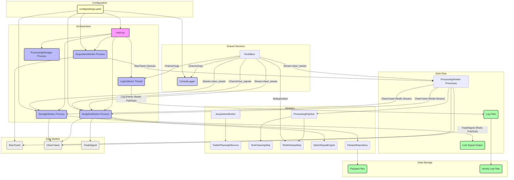

# Market Intelligence System Architecture

```mermaid
graph TD
    subgraph Orchestration
        A[main.py] --> B(LogCollector Thread)
        A --> C(AcquisitionWorker Process)
        A --> D(ProcessingManager Process)
        A --> E(AnalyticsWorker Process)
        A --> F(StorageWorker Process)
    end

    subgraph Data Flow
        C -- RawTweet (Queue) --> D_W(ProcessingWorker Processes)
        D_W -- CleanTweet (Redis Stream) --> E
        D_W -- CleanTweet (Redis Stream) --> F
        E -- TradeSignal (Redis Pub/Sub) --> G(Live Signal Output)
        B -- Log Entries (Redis Pub/Sub) --> H(Log Files)
    end

    subgraph Modules
        C_S[AcquisitionWorker] --> C_T(TwitterPlaywrightSource)
        D_W --> D_P(ProcessingPipeline)
        D_P --> D_TC(TextCleaningStep)
        D_P --> D_RD(RedisDedupStep)
        E --> E_H(HybridSignalEngine)
        F --> F_P(ParquetRepository)
    end

    subgraph Shared Services
        RedisBus -- Deduplication --> D_RD
        RedisBus -- Stream:clean_tweets --> D_W
        RedisBus -- Stream:clean_tweets --> E
        RedisBus -- Stream:clean_tweets --> F
        RedisBus -- Channel:live_signals --> E
        RedisBus -- Channel:logs --> B
        RedisBus -- Channel:logs --> I(CentralLogger)
    end

    subgraph Data Storage
        F_P --> J(Parquet Files)
        H --> K(Hourly Log Files)
    end

    subgraph Configuration
        L(config/settings.yaml) --> A
        L --> C
        L --> E
        L --> F
        L --> I
    end

    subgraph Data Models
        M(RawTweet)
        N(CleanTweet)
        O(TradeSignal)
    end

    C --> M
    D_W --> M
    D_W --> N
    E --> N
    E --> O
    F --> N

    style A fill:#f9f,stroke:#333,stroke-width:2px
    style B fill:#bbf,stroke:#333,stroke-width:2px
    style C fill:#bbf,stroke:#333,stroke-width:2px
    style D fill:#bbf,stroke:#333,stroke-width:2px
    style E fill:#bbf,stroke:#333,stroke-width:2px
    style F fill:#bbf,stroke:#333,stroke-width:2px
    style G fill:#afa,stroke:#333,stroke-width:2px
    style H fill:#afa,stroke:#333,stroke-width:2px
    style I fill:#ccf,stroke:#333,stroke-width:2px
    style J fill:#afa,stroke:#333,stroke-width:2px
    style K fill:#afa,stroke:#333,stroke-width:2px
    style L fill:#ffc,stroke:#333,stroke-width:2px
    style M fill:#eee,stroke:#333,stroke-width:1px
    style N fill:#eee,stroke:#333,stroke-width:1px
    style O fill:#eee,stroke:#333,stroke-width:1px
```