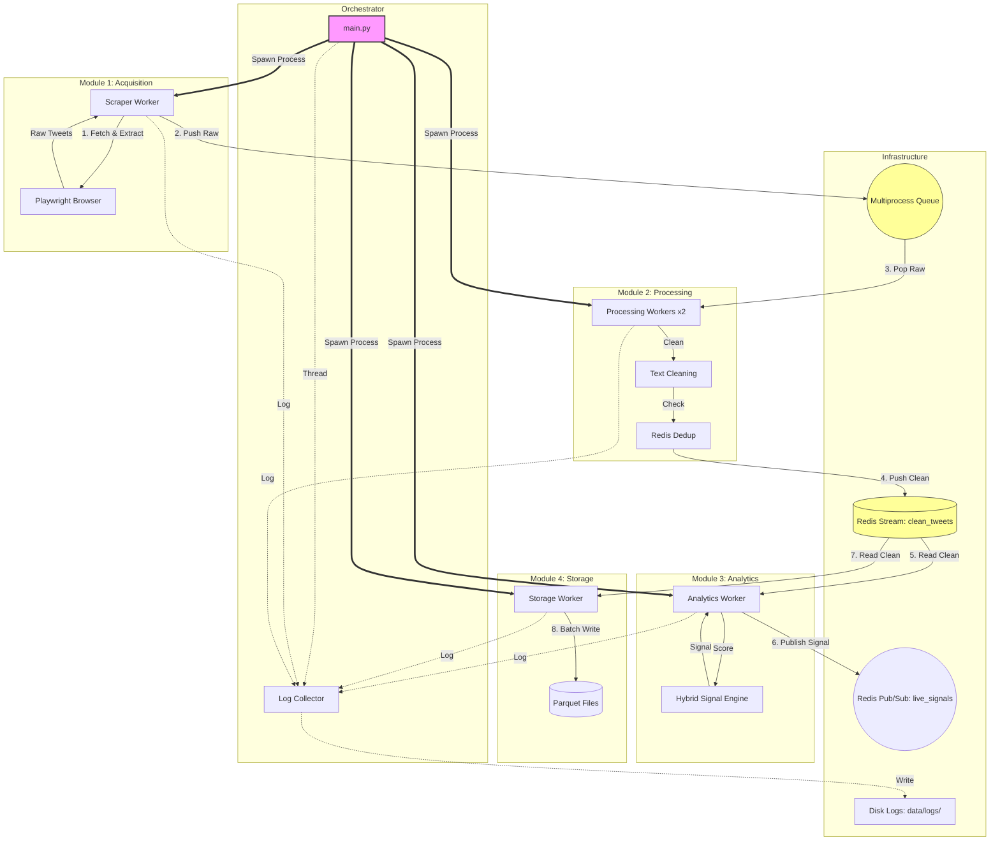

# System Architecture

## Data & Control Flow

```mermaid
graph TB
    %% --- Nodes ---
    
    subgraph Orchestrator
        MAIN[main.py]
        LOG_COLLECT[Log Collector]
    end

    subgraph "Module 1: Acquisition"
        SCRAPER[Scraper Worker]
        BROWSER[Playwright Browser]
    end

    subgraph "Module 2: Processing"
        PROC[Processing Workers x2]
        CLEAN[Text Cleaning]
        DEDUP[Redis Dedup]
    end

    subgraph "Module 3: Analytics"
        ANALYTICS[Analytics Worker]
        ENGINE[Hybrid Signal Engine]
    end

    subgraph "Module 4: Storage"
        STORAGE[Storage Worker]
        DISK[(Parquet Files)]
    end

    subgraph Infrastructure
        QUEUE((Multiprocess Queue))
        STREAM[(Redis Stream: clean_tweets)]
        PUBSUB((Redis Pub/Sub: live_signals))
        LOGS[Disk Logs: data/logs/]
    end

    %% --- Connections ---

    %% Control Flow (Spawning)
    MAIN ==>|Spawn Process| SCRAPER
    MAIN ==>|Spawn Process| PROC
    MAIN ==>|Spawn Process| ANALYTICS
    MAIN ==>|Spawn Process| STORAGE
    MAIN -.->|Thread| LOG_COLLECT

    %% Data Flow
    SCRAPER -->|1. Fetch & Extract| BROWSER
    BROWSER -->|Raw Tweets| SCRAPER
    SCRAPER -->|2. Push Raw| QUEUE

    QUEUE -->|3. Pop Raw| PROC
    PROC -->|Clean| CLEAN
    CLEAN -->|Check| DEDUP
    DEDUP -->|4. Push Clean| STREAM

    STREAM -->|5. Read Clean| ANALYTICS
    ANALYTICS -->|Score| ENGINE
    ENGINE -->|Signal| ANALYTICS
    ANALYTICS -->|6. Publish Signal| PUBSUB

    STREAM -->|7. Read Clean| STORAGE
    STORAGE -->|8. Batch Write| DISK

    %% Logging Flow
    SCRAPER -.->|Log| LOG_COLLECT
    PROC -.->|Log| LOG_COLLECT
    ANALYTICS -.->|Log| LOG_COLLECT
    STORAGE -.->|Log| LOG_COLLECT
    LOG_COLLECT -.->|Write| LOGS

    %% Styling
    style MAIN fill:#f9f,stroke:#333,stroke-width:2px
    style STREAM fill:#ff9,stroke:#333
    style QUEUE fill:#ff9,stroke:#333
```

