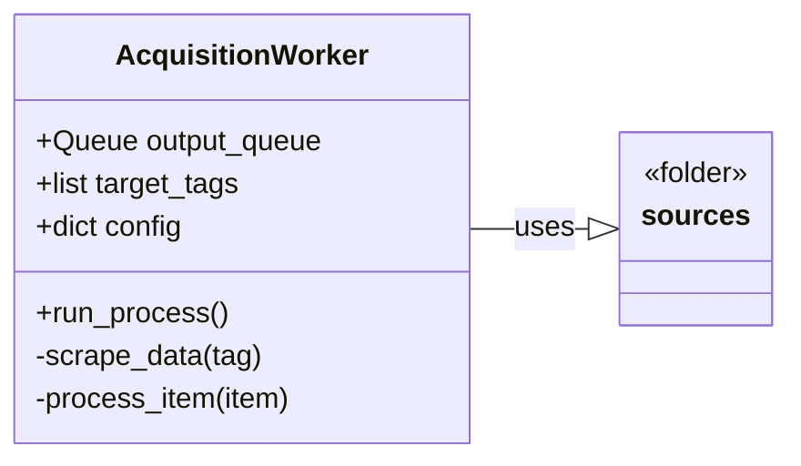
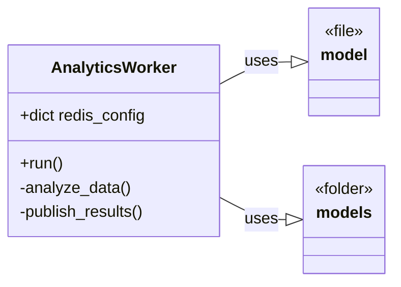
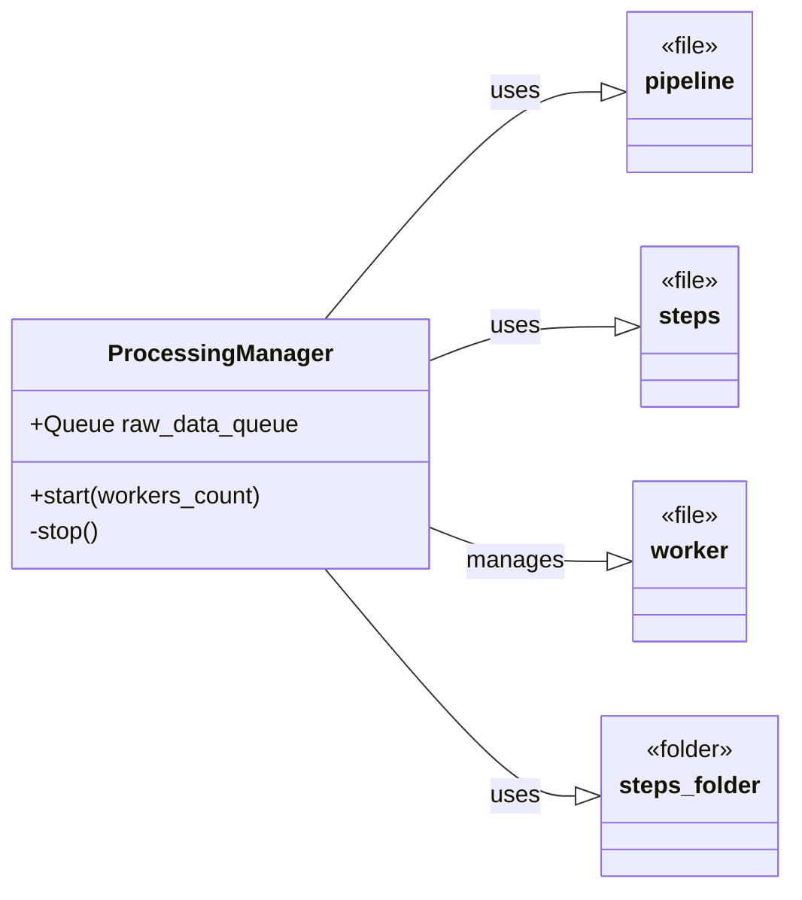
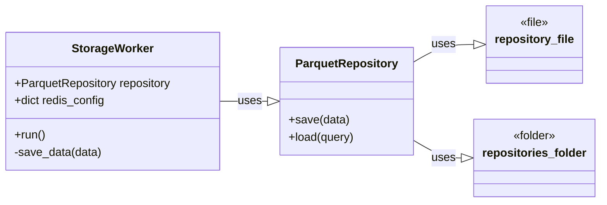

# Module UML Diagrams

## Acquisition Module

```mermaid
classDiagram
    direction LR
    class AcquisitionWorker {
        +Queue output_queue
        +list target_tags
        +dict config
        +run_process()
        -scrape_data(tag)
        -process_item(item)
    }
    class sources {
        <<folder>>
    }
    AcquisitionWorker --|> sources : uses
```

## Analytics Module

```mermaid
classDiagram
    direction LR
    class AnalyticsWorker {
        +dict redis_config
        +run()
        -analyze_data()
        -publish_results()
    }
    class model {
        <<file>>
    }
    class models {
        <<folder>>
    }
    AnalyticsWorker --|> model : uses
    AnalyticsWorker --|> models : uses
```

## Processing Module

```mermaid
classDiagram
    direction LR
    class ProcessingManager {
        +Queue raw_data_queue
        +start(workers_count)
        -stop()
    }
    class pipeline {
        <<file>>
    }
    class steps {
        <<file>>
    }
    class worker {
        <<file>>
    }
    class steps_folder {
        <<folder>>
    }
    ProcessingManager --|> pipeline : uses
    ProcessingManager --|> steps : uses
    ProcessingManager --|> worker : manages
    ProcessingManager --|> steps_folder : uses
```

## Storage Module

```mermaid
classDiagram
    direction LR
    class StorageWorker {
        +ParquetRepository repository
        +dict redis_config
        +run()
        -save_data(data)
    }
    class ParquetRepository {
        +save(data)
        +load(query)
    }
    class repository_file {
        <<file>>
    }
    class repositories_folder {
        <<folder>>
    }
    StorageWorker --|> ParquetRepository : uses
    ParquetRepository --|> repository_file : uses
    ParquetRepository --|> repositories_folder : uses
```

