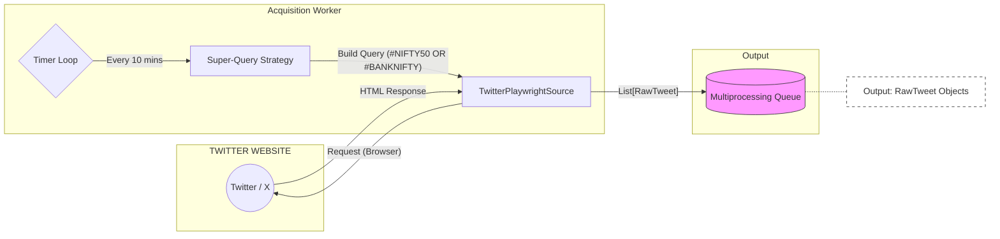

```mermaid
flowchart LR
    subgraph External ["TWITTER WEBSITE"]
        Twitter((Twitter / X))
    end

    subgraph Acquisition ["Acquisition Worker"]
        Timer{Timer Loop}
        Source["TwitterPlaywrightSource"]
        Logic["Super-Query Strategy"]
    end

    subgraph Output_Layer ["Output"]
        Queue[("Multiprocessing Queue")]
    end

    %% Flow
    Timer -- "Every 10 mins" --> Logic
    Logic -- "Build Query (#NIFTY50 OR #BANKNIFTY)" --> Source
    Source -- "Request (Browser)" --> Twitter
    Twitter -- "HTML Response" --> Source
    Source -- "List[RawTweet]" --> Queue

    %% Data Shape
    style Queue fill:#f9f,stroke:#333
    note["Output: RawTweet Objects"]:::note
    Queue -.- note

    classDef note fill:#fff,stroke:#333,stroke-dasharray: 5 5;

```