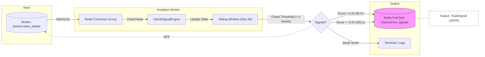

```mermaid
flowchart LR
    subgraph Input_Layer ["Input"]
        RedisStream[("Stream: stream:clean_tweets")]
    end

    subgraph Worker ["Analytics Worker"]
        Consumer["Redis Consumer Group"]
        Engine["HybridSignalEngine"]
        Window["Sliding Window (Size 50)"]
    end

    subgraph Output_Layer ["Output"]
        PubSub[("Redis Pub/Sub: channel:live_signals")]
        Logs["Terminal / Logs"]
    end

    %% Flow
    RedisStream -- "Batch(10)" --> Consumer
    Consumer -- "CleanTweet" --> Engine
    Engine -- "Update State" --> Window
    
    Window -- "Check Threshold (> 5 tweets)" --> Decision{Signals?}
    
    Decision -- "Score > 0.25 (BUY)" --> PubSub
    Decision -- "Score < -0.25 (SELL)" --> PubSub
    Decision -- "Weak Score" --> Logs
    
    %% Ack Flow
    Decision -.->|ACK| RedisStream

    %% Data Shape
    style PubSub fill:#f9f,stroke:#333
    note["Output: TradeSignal (JSON)"]:::note
    PubSub -.- note

    classDef note fill:#fff,stroke:#333,stroke-dasharray: 5 5;

```