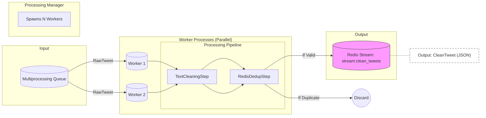

```mermaid
flowchart LR
    subgraph Input_Layer ["Input"]
        Queue[("Multiprocessing Queue")]
    end

    subgraph Manager ["Processing Manager"]
        Orchestrator["Spawns N Workers"]
    end

    subgraph Workers ["Worker Processes (Parallel)"]
        W1[("Worker 1")]
        W2[("Worker 2")]
        
        subgraph Pipeline ["Processing Pipeline"]
            Clean["TextCleaningStep"]
            Dedup["RedisDedupStep"]
        end
    end

    subgraph Output_Layer ["Output"]
        Redis[("Redis Stream: stream:clean_tweets")]
    end

    %% Flow
    Queue -- "RawTweet" --> W1
    Queue -- "RawTweet" --> W2
    
    W1 --> Clean --> Dedup
    W2 --> Clean --> Dedup

    Dedup -- "If Valid" --> Redis
    Dedup -- "If Duplicate" --> Discard((Discard))

    %% Data Shape
    style Redis fill:#f9f,stroke:#333
    note["Output: CleanTweet (JSON)"]:::note
    Redis -.- note

    classDef note fill:#fff,stroke:#333,stroke-dasharray: 5 5;

```