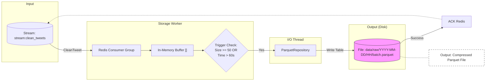

```mermaid
flowchart LR
    subgraph Input_Layer ["Input"]
        RedisStream[("Stream: stream:clean_tweets")]
    end

    subgraph Worker ["Storage Worker"]
        Consumer["Redis Consumer Group"]
        Buffer["In-Memory Buffer []"]
        Triggers{"Trigger Check:<br/>Size >= 50 OR<br/>Time > 60s"}
    end

    subgraph IO ["I/O Thread"]
        Repo["ParquetRepository"]
    end

    subgraph Output_Layer ["Output (Disk)"]
        File[("File: data/raw/YYYY-MM-DD/HH/batch.parquet")]
    end

    %% Flow
    RedisStream -- "CleanTweet" --> Consumer
    Consumer --> Buffer
    Buffer --> Triggers
    
    Triggers -- "Yes" --> Repo
    Repo -- "Write Table" --> File
    
    File -- "Success" --> Ack["ACK Redis"]
    Ack -.-> RedisStream

    %% Data Shape
    style File fill:#f9f,stroke:#333
    note["Output: Compressed Parquet File"]:::note
    File -.- note

    classDef note fill:#fff,stroke:#333,stroke-dasharray: 5 5;

```